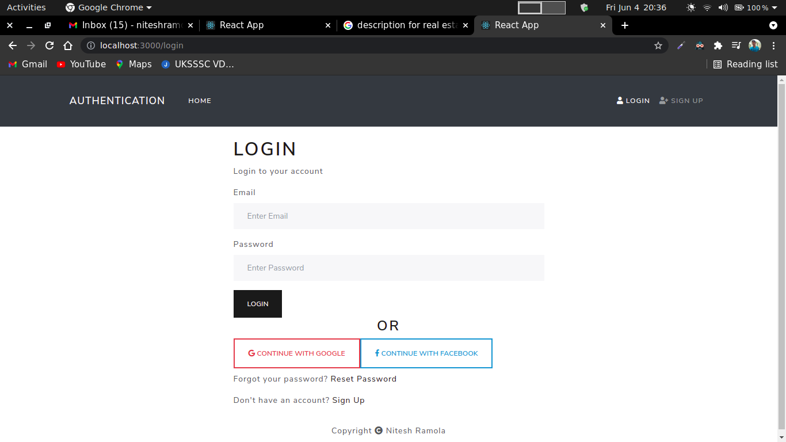

# Authentication System Django + React

* This is a project that demonstrates how you could implement a fully featured JSON Web Token Authentication system in Django and React.

# Features

* Account Creation with verifing email id
* Account activation
* Password Reset using email id
* Social Authentication
* Google OAuth2
* Facebook OAuth2

# Download & Setup Instructions

* 1 - Clone project: git clone https://github.com/NiteshRamola/Authentication_Django_React/
* 2 - cd Authentication_Django_React
* 3 - Create virtual environment: virtualenv myenv
* 4 - source myenv\bin\activate
* 5 - pip install -r requirements.txt
* 6 - python manage.py runserver

# Install react modules
* 1 - cd frontend
* 2 - npm install
